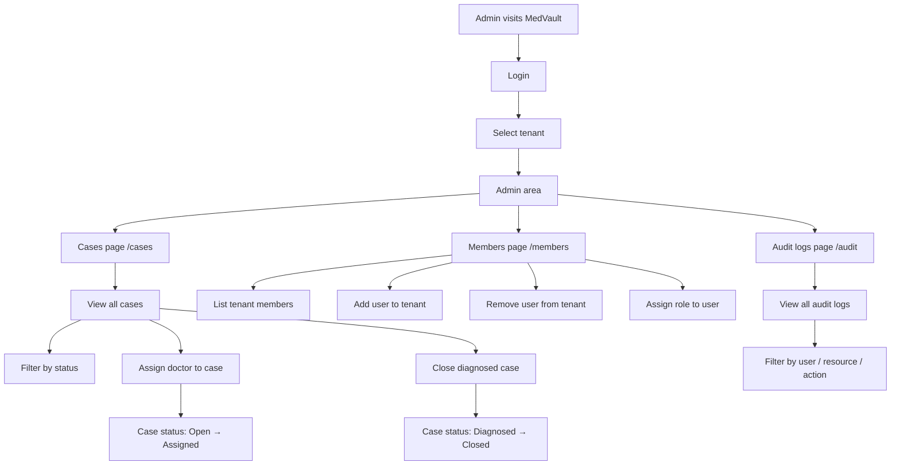
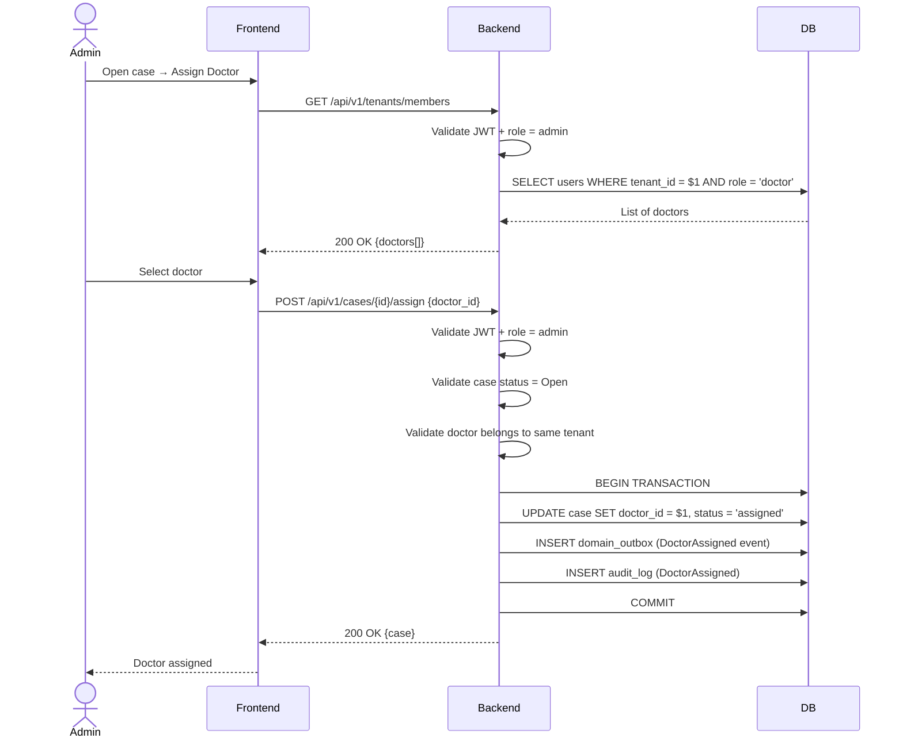
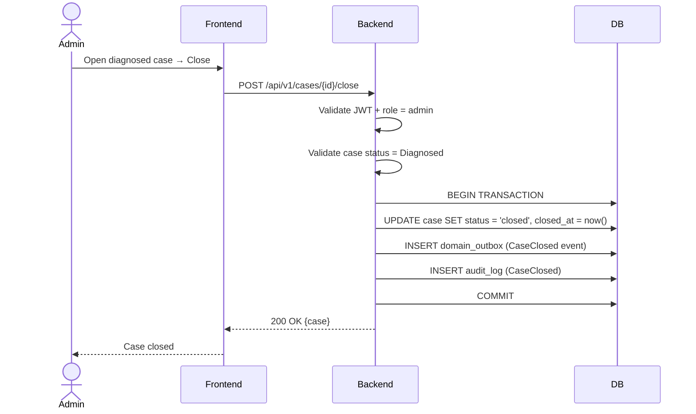
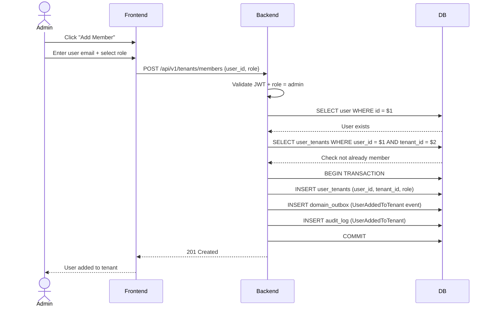
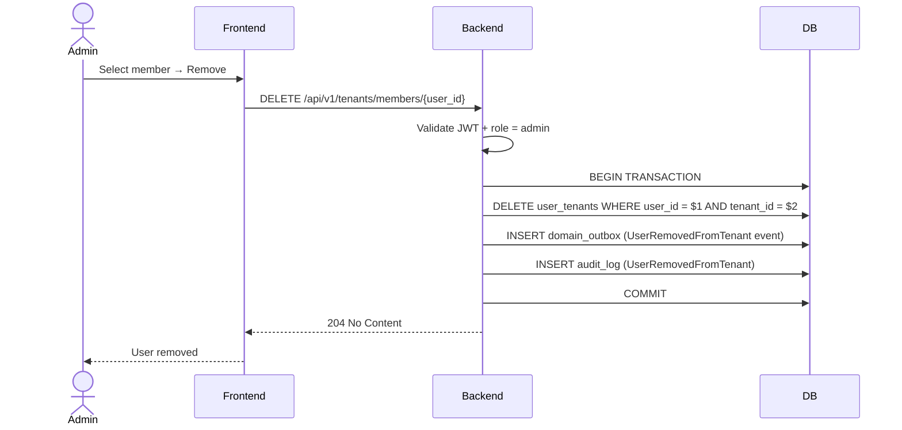
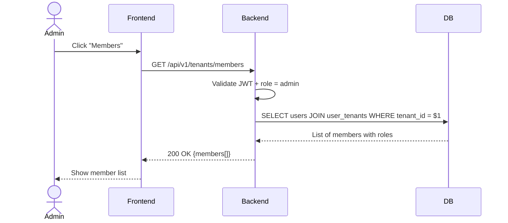
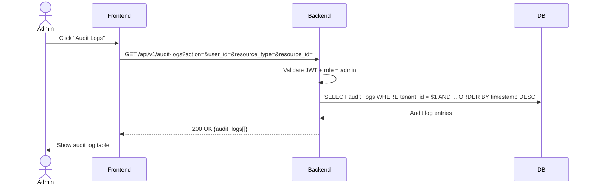
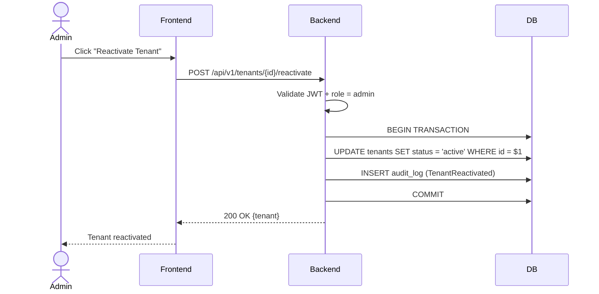

# Administrator Workflow

## Complete Admin Journey

## Assign Doctor to Case

## Close Diagnosed Case

## Add User to Tenant

## Remove User from Tenant

## List Tenant Members

## View Audit Logs

## Reactivate Suspended Tenant

