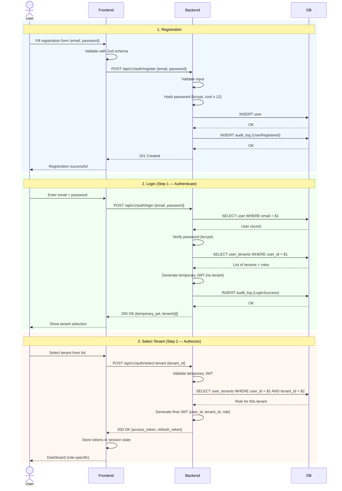
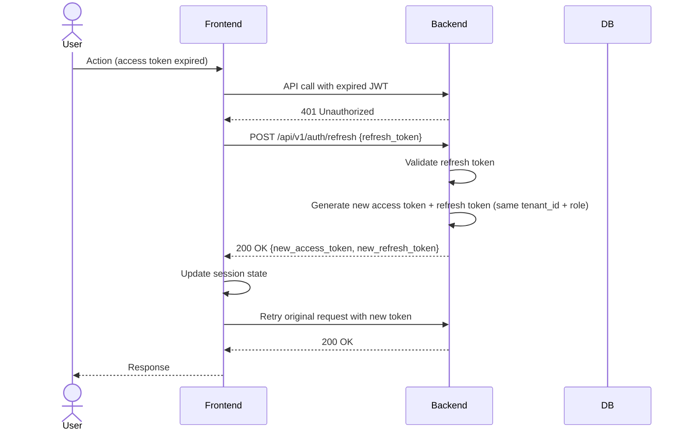
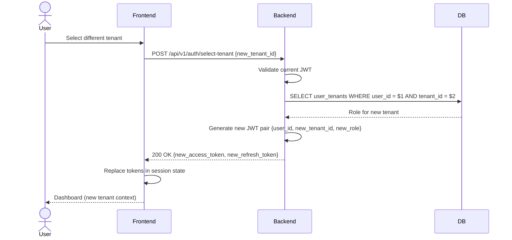
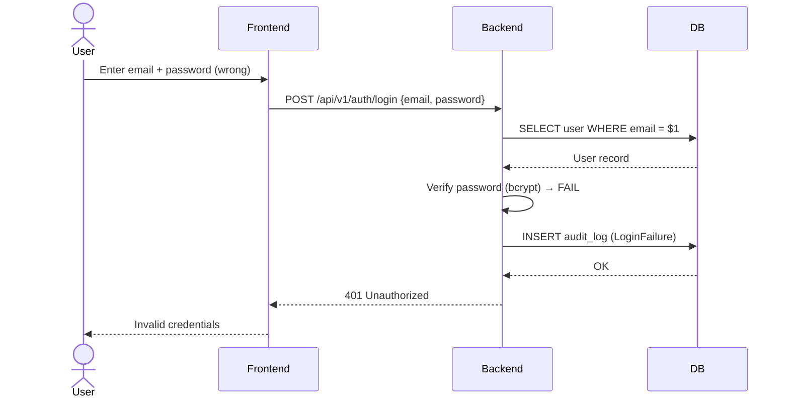

# Authentication Flow

## Registration + Login + Tenant Selection

```mermaid
sequenceDiagram
    actor User
    participant Frontend
    participant Backend
    participant DB

    rect rgb(240, 248, 255)
        Note over User, DB: 1. Registration
        User->>Frontend: Fill registration form (email, password)
        Frontend->>Frontend: Validate with Zod schema
        Frontend->>Backend: POST /api/v1/auth/register {email, password}
        Backend->>Backend: Validate input
        Backend->>Backend: Hash password (bcrypt, cost ≥ 12)
        Backend->>DB: INSERT user
        DB-->>Backend: OK
        Backend->>DB: INSERT audit_log (UserRegistered)
        DB-->>Backend: OK
        Backend-->>Frontend: 201 Created
        Frontend-->>User: Registration successful
    end

    rect rgb(240, 255, 240)
        Note over User, DB: 2. Login (Step 1 — Authenticate)
        User->>Frontend: Enter email + password
        Frontend->>Backend: POST /api/v1/auth/login {email, password}
        Backend->>DB: SELECT user WHERE email = $1
        DB-->>Backend: User record
        Backend->>Backend: Verify password (bcrypt)
        Backend->>DB: SELECT user_tenants WHERE user_id = $1
        DB-->>Backend: List of tenants + roles
        Backend->>Backend: Generate temporary JWT (no tenant)
        Backend->>DB: INSERT audit_log (LoginSuccess)
        DB-->>Backend: OK
        Backend-->>Frontend: 200 OK {temporary_jwt, tenants[]}
        Frontend-->>User: Show tenant selection
    end

    rect rgb(255, 248, 240)
        Note over User, DB: 3. Select Tenant (Step 2 — Authorize)
        User->>Frontend: Select tenant from list
        Frontend->>Backend: POST /api/v1/auth/select-tenant {tenant_id}
        Backend->>Backend: Validate temporary JWT
        Backend->>DB: SELECT user_tenants WHERE user_id = $1 AND tenant_id = $2
        DB-->>Backend: Role for this tenant
        Backend->>Backend: Generate final JWT {user_id, tenant_id, role}
        Backend-->>Frontend: 200 OK {access_token, refresh_token}
        Frontend->>Frontend: Store tokens in session state
        Frontend-->>User: Dashboard (role-specific)
    end
```

## Token Refresh

```mermaid
sequenceDiagram
    actor User
    participant Frontend
    participant Backend
    participant DB

    User->>Frontend: Action (access token expired)
    Frontend->>Backend: API call with expired JWT
    Backend-->>Frontend: 401 Unauthorized
    Frontend->>Backend: POST /api/v1/auth/refresh {refresh_token}
    Backend->>Backend: Validate refresh token
    Backend->>Backend: Generate new access token + refresh token (same tenant_id + role)
    Backend-->>Frontend: 200 OK {new_access_token, new_refresh_token}
    Frontend->>Frontend: Update session state
    Frontend->>Backend: Retry original request with new token
    Backend-->>Frontend: 200 OK
    Frontend-->>User: Response
```

## Tenant Switch

```mermaid
sequenceDiagram
    actor User
    participant Frontend
    participant Backend
    participant DB

    User->>Frontend: Select different tenant
    Frontend->>Backend: POST /api/v1/auth/select-tenant {new_tenant_id}
    Backend->>Backend: Validate current JWT
    Backend->>DB: SELECT user_tenants WHERE user_id = $1 AND tenant_id = $2
    DB-->>Backend: Role for new tenant
    Backend->>Backend: Generate new JWT pair {user_id, new_tenant_id, new_role}
    Backend-->>Frontend: 200 OK {new_access_token, new_refresh_token}
    Frontend->>Frontend: Replace tokens in session state
    Frontend-->>User: Dashboard (new tenant context)
```

## Login Failure

```mermaid
sequenceDiagram
    actor User
    participant Frontend
    participant Backend
    participant DB

    User->>Frontend: Enter email + password (wrong)
    Frontend->>Backend: POST /api/v1/auth/login {email, password}
    Backend->>DB: SELECT user WHERE email = $1
    DB-->>Backend: User record
    Backend->>Backend: Verify password (bcrypt) → FAIL
    Backend->>DB: INSERT audit_log (LoginFailure)
    DB-->>Backend: OK
    Backend-->>Frontend: 401 Unauthorized
    Frontend-->>User: Invalid credentials
```
