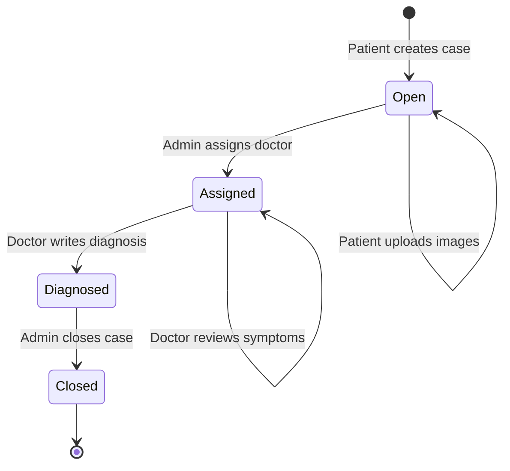
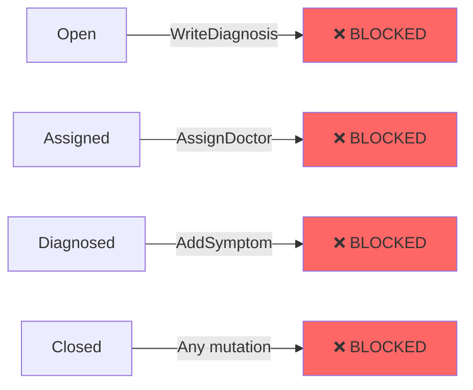
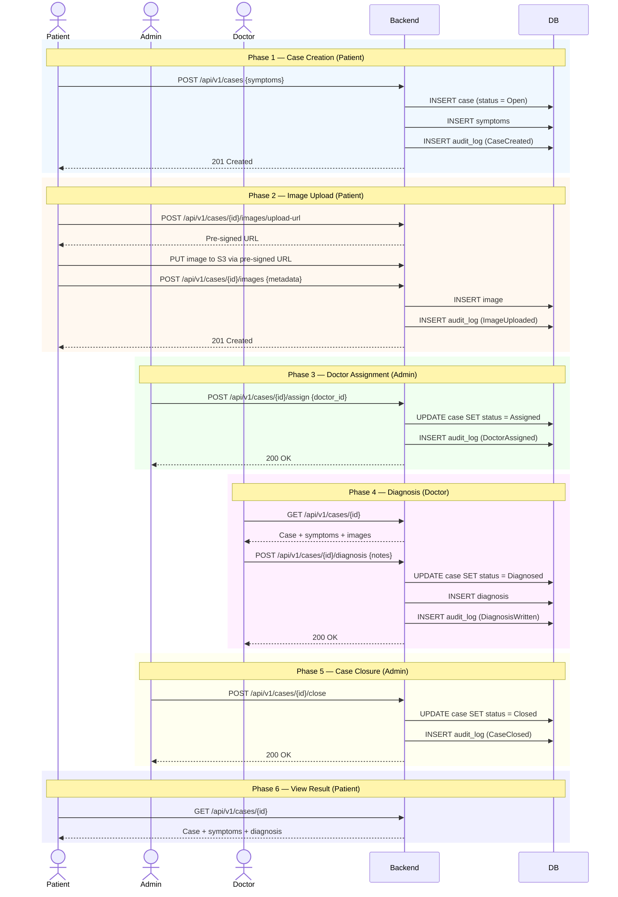

# Case Lifecycle

## Status Transitions

## State Transition Rules

| From | To | Trigger | Actor | Preconditions |
|------|----|---------|-------|---------------|
| — | Open | CreateCase | Patient | Authenticated, valid tenant |
| Open | Assigned | AssignDoctor | Admin | Case has symptoms; doctor belongs to same tenant |
| Assigned | Diagnosed | WriteDiagnosis | Doctor | Doctor is assigned to case |
| Diagnosed | Closed | CloseCase | Admin | Diagnosis exists |
| Open | Open | AddSymptom | Patient | Case belongs to patient, status = Open |
| Open | Open | UploadImage | Patient | Case belongs to patient, status = Open |

## Invalid Transitions (Blocked)

## Full Case Flow (All Actors)

