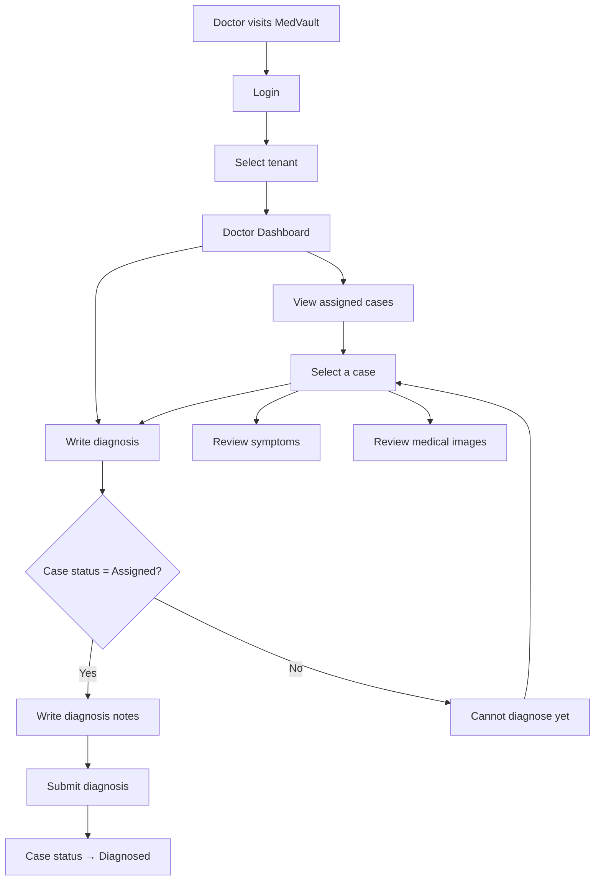
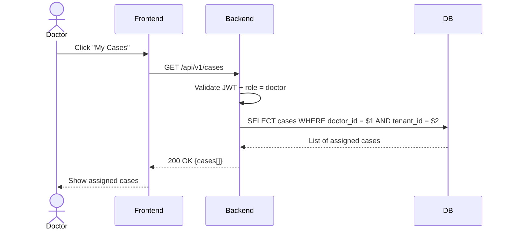
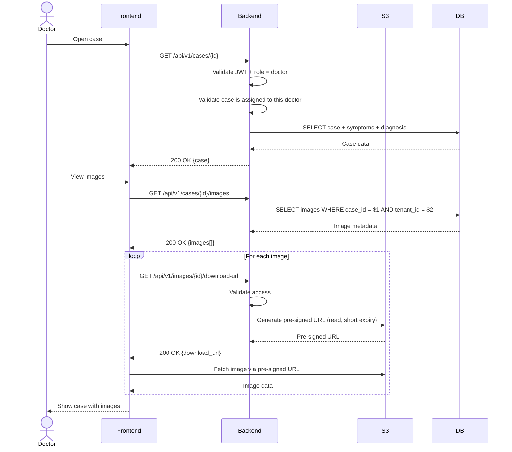
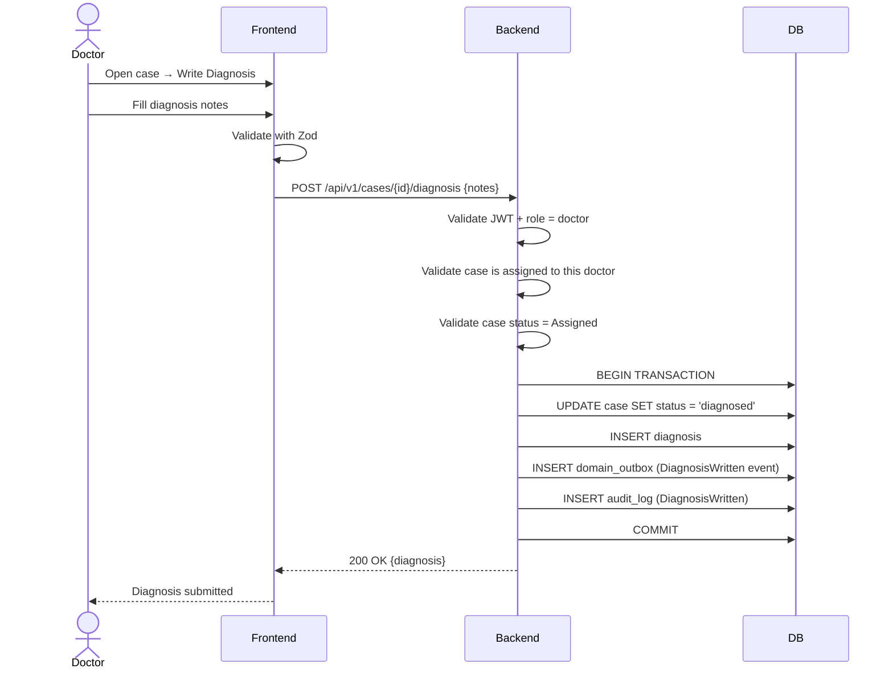

# Doctor Workflow

## Complete Doctor Journey

```mermaid
flowchart TD
    A[Doctor visits MedVault] --> B[Login]
    B --> C[Select tenant]
    C --> D[Doctor Dashboard]

    D --> E[View assigned cases]
    D --> F[Write diagnosis]

    E --> G[Select a case]
    G --> H[Review symptoms]
    G --> I[Review medical images]
    G --> F

    F --> J{Case status = Assigned?}
    J -->|Yes| K[Write diagnosis notes]
    K --> L[Submit diagnosis]
    L --> M[Case status → Diagnosed]
    J -->|No| N[Cannot diagnose yet]
    N --> G
```

## View Assigned Cases

```mermaid
sequenceDiagram
    actor Doctor
    participant Frontend
    participant Backend
    participant DB

    Doctor->>Frontend: Click "My Cases"
    Frontend->>Backend: GET /api/v1/cases
    Backend->>Backend: Validate JWT + role = doctor
    Backend->>DB: SELECT cases WHERE doctor_id = $1 AND tenant_id = $2
    DB-->>Backend: List of assigned cases
    Backend-->>Frontend: 200 OK {cases[]}
    Frontend-->>Doctor: Show assigned cases
```

## Review Case Details + Images

```mermaid
sequenceDiagram
    actor Doctor
    participant Frontend
    participant Backend
    participant S3
    participant DB

    Doctor->>Frontend: Open case
    Frontend->>Backend: GET /api/v1/cases/{id}
    Backend->>Backend: Validate JWT + role = doctor
    Backend->>Backend: Validate case is assigned to this doctor
    Backend->>DB: SELECT case + symptoms + diagnosis
    DB-->>Backend: Case data
    Backend-->>Frontend: 200 OK {case}

    Doctor->>Frontend: View images
    Frontend->>Backend: GET /api/v1/cases/{id}/images
    Backend->>DB: SELECT images WHERE case_id = $1 AND tenant_id = $2
    DB-->>Backend: Image metadata
    Backend-->>Frontend: 200 OK {images[]}

    loop For each image
        Frontend->>Backend: GET /api/v1/images/{id}/download-url
        Backend->>Backend: Validate access
        Backend->>S3: Generate pre-signed URL (read, short expiry)
        S3-->>Backend: Pre-signed URL
        Backend-->>Frontend: 200 OK {download_url}
        Frontend->>S3: Fetch image via pre-signed URL
        S3-->>Frontend: Image data
    end

    Frontend-->>Doctor: Show case with images
```

## Write Diagnosis

```mermaid
sequenceDiagram
    actor Doctor
    participant Frontend
    participant Backend
    participant DB

    Doctor->>Frontend: Open case → Write Diagnosis
    Doctor->>Frontend: Fill diagnosis notes
    Frontend->>Frontend: Validate with Zod
    Frontend->>Backend: POST /api/v1/cases/{id}/diagnosis {notes}
    Backend->>Backend: Validate JWT + role = doctor
    Backend->>Backend: Validate case is assigned to this doctor
    Backend->>Backend: Validate case status = Assigned
    Backend->>DB: BEGIN TRANSACTION
    Backend->>DB: UPDATE case SET status = 'diagnosed'
    Backend->>DB: INSERT diagnosis
    Backend->>DB: INSERT domain_outbox (DiagnosisWritten event)
    Backend->>DB: INSERT audit_log (DiagnosisWritten)
    Backend->>DB: COMMIT
    Backend-->>Frontend: 200 OK {diagnosis}
    Frontend-->>Doctor: Diagnosis submitted
```
