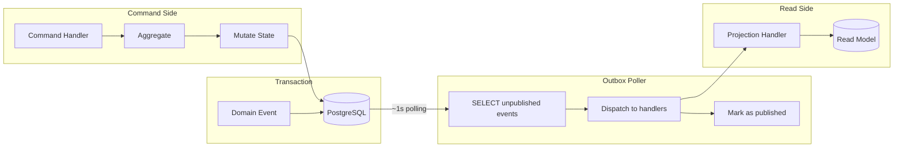
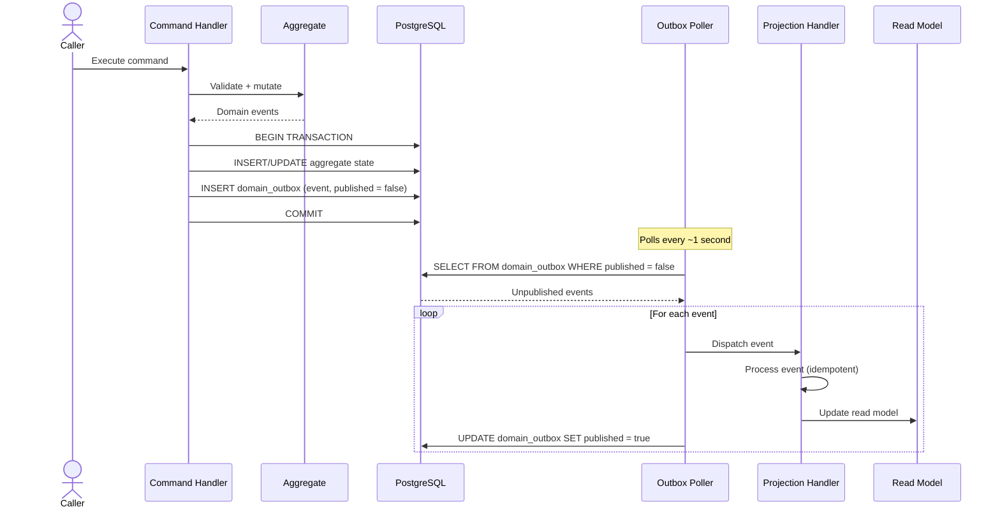
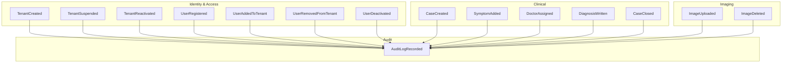

# Domain Events Flow (Transactional Outbox)

## Outbox Pattern Overview



## Event Flow Sequence



## Domain Events Catalog



## Event → Projection Mapping

| Event | Source Context | Projection Target |
|-------|---------------|-------------------|
| UserRegistered | Identity | UserReadModel |
| UserAddedToTenant | Identity | UserTenantReadModel |
| UserRemovedFromTenant | Identity | UserTenantReadModel |
| CaseCreated | Clinical | CaseReadModel |
| SymptomAdded | Clinical | CaseReadModel |
| DoctorAssigned | Clinical | CaseReadModel |
| DiagnosisWritten | Clinical | CaseReadModel |
| CaseClosed | Clinical | CaseReadModel |
| ImageUploaded | Imaging | ImageReadModel |
| AuditLogRecorded | Audit | AuditLogReadModel |

## Delivery Guarantees

| Property | Value |
|----------|-------|
| Delivery guarantee | At-least-once |
| Ordering | Per-aggregate (same aggregate = ordered) |
| Latency | ~1 second (polling interval) |
| Idempotency | Required (projection handlers must be idempotent) |
| Failed events | `attempts` counter incremented; retried with backoff |
| Max retries | Configurable (default: 5) |
| Dead letter | Events exceeding max retries moved to dead-letter table |

## Event Payload Structure

```json
{
  "event_id": "uuid",
  "event_type": "CaseCreated",
  "aggregate_type": "Case",
  "aggregate_id": "uuid",
  "tenant_id": "uuid",
  "occurred_at": "2024-01-01T00:00:00Z",
  "payload": {
    "case_id": "uuid",
    "patient_id": "uuid",
    "status": "open"
  }
}
```
