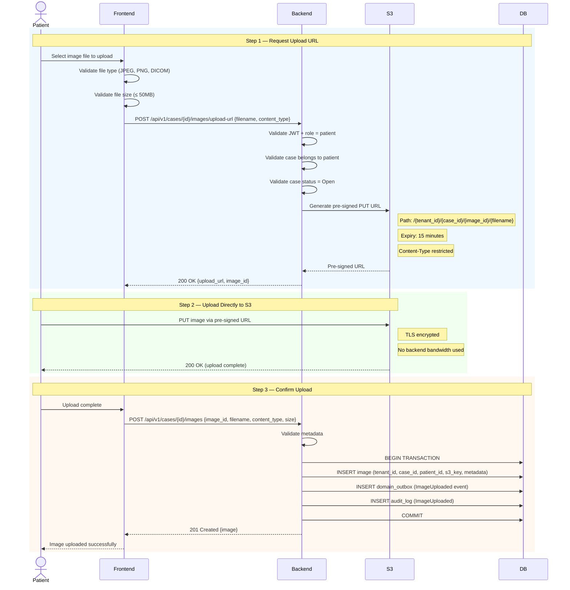
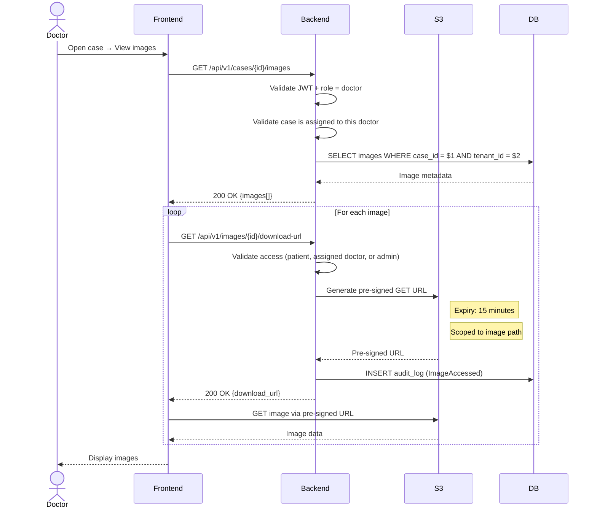

# Image Upload Flow

## Pre-Signed URL Upload (Client → S3 Direct)

## Image Download (Doctor Viewing)

## Security Constraints

| Constraint | Implementation |
|------------|----------------|
| File types | Allowlist: image/jpeg, image/png, image/dicom |
| Max file size | 50MB |
| Upload URL expiry | 15 minutes |
| Download URL expiry | 15 minutes |
| Storage path | `/{tenant_id}/{case_id}/{image_id}/{filename}` |
| Encryption at rest | AES-256 (SSE-S3) |
| Encryption in transit | TLS 1.2+ |
| Access control | Patient (own), Doctor (assigned), Admin (tenant) |
| Audit | Every upload and download logged |
