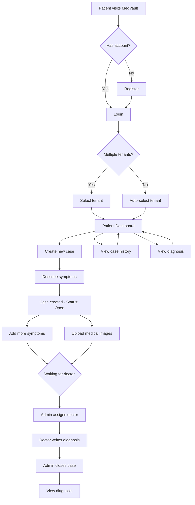
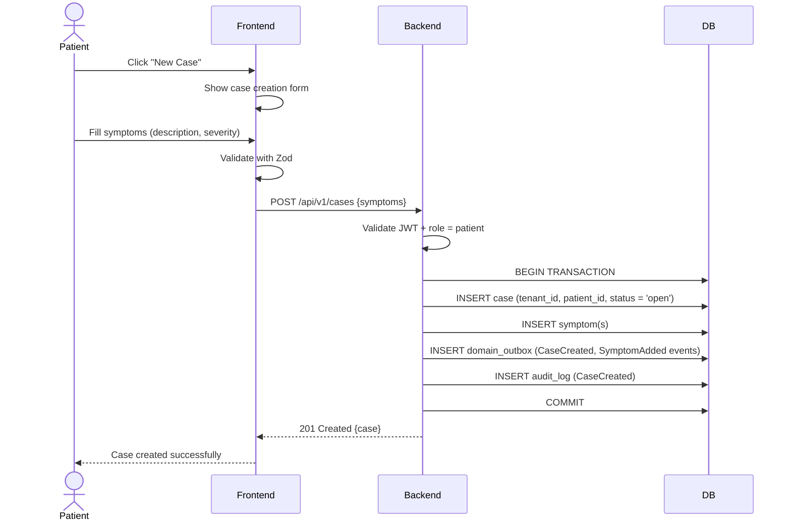
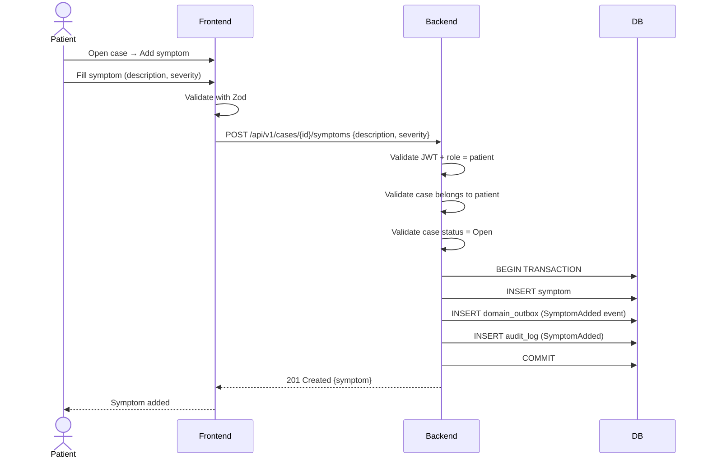
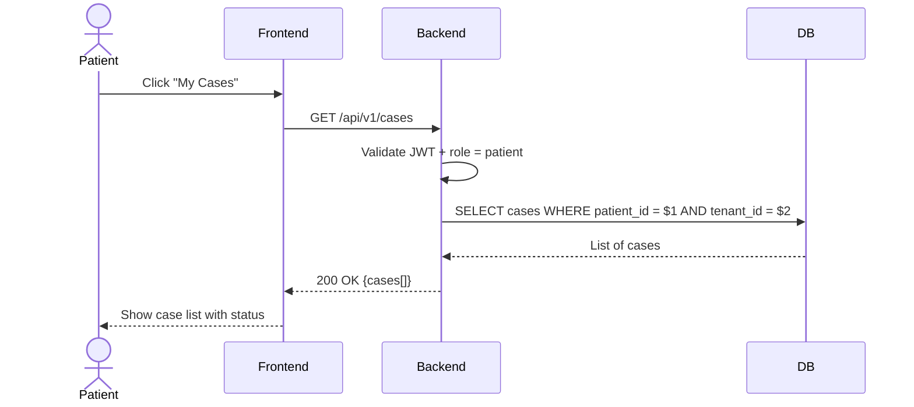
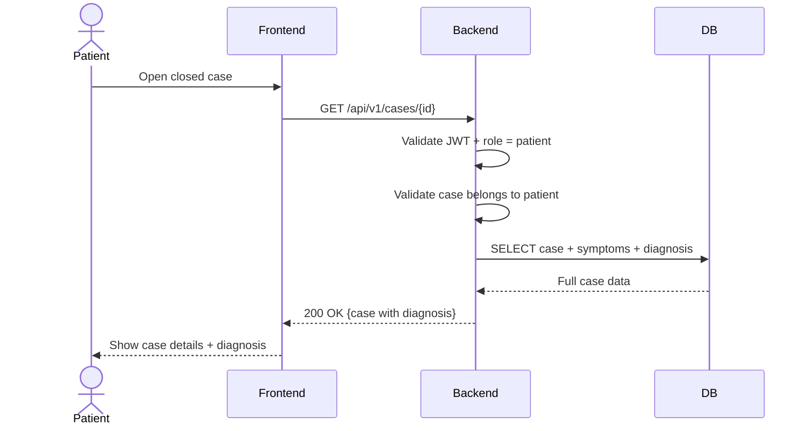

# Patient Workflow

## Complete Patient Journey

```mermaid
flowchart TD
    A[Patient visits MedVault] --> B{Has account?}
    B -->|No| C[Register]
    B -->|Yes| D[Login]
    C --> D

    D --> E{Multiple tenants?}
    E -->|Yes| F[Select tenant]
    E -->|No| G[Auto-select tenant]
    F --> H[Patient Dashboard]
    G --> H

    H --> I[Create new case]
    H --> J[View case history]
    H --> K[View diagnosis]

    I --> L[Describe symptoms]
    L --> M[Case created - Status: Open]
    M --> N[Add more symptoms]
    M --> O[Upload medical images]
    N --> P{Waiting for doctor}
    O --> P
    P --> Q[Admin assigns doctor]
    Q --> R[Doctor writes diagnosis]
    R --> S[Admin closes case]
    S --> T[View diagnosis]

    J --> H
    K --> H
```

## Create Case with Symptoms

```mermaid
sequenceDiagram
    actor Patient
    participant Frontend
    participant Backend
    participant DB

    Patient->>Frontend: Click "New Case"
    Frontend->>Frontend: Show case creation form
    Patient->>Frontend: Fill symptoms (description, severity)
    Frontend->>Frontend: Validate with Zod
    Frontend->>Backend: POST /api/v1/cases {symptoms}
    Backend->>Backend: Validate JWT + role = patient
    Backend->>DB: BEGIN TRANSACTION
    Backend->>DB: INSERT case (tenant_id, patient_id, status = 'open')
    Backend->>DB: INSERT symptom(s)
    Backend->>DB: INSERT domain_outbox (CaseCreated, SymptomAdded events)
    Backend->>DB: INSERT audit_log (CaseCreated)
    Backend->>DB: COMMIT
    Backend-->>Frontend: 201 Created {case}
    Frontend-->>Patient: Case created successfully
```

## Add Symptoms to Existing Case

```mermaid
sequenceDiagram
    actor Patient
    participant Frontend
    participant Backend
    participant DB

    Patient->>Frontend: Open case → Add symptom
    Patient->>Frontend: Fill symptom (description, severity)
    Frontend->>Frontend: Validate with Zod
    Frontend->>Backend: POST /api/v1/cases/{id}/symptoms {description, severity}
    Backend->>Backend: Validate JWT + role = patient
    Backend->>Backend: Validate case belongs to patient
    Backend->>Backend: Validate case status = Open
    Backend->>DB: BEGIN TRANSACTION
    Backend->>DB: INSERT symptom
    Backend->>DB: INSERT domain_outbox (SymptomAdded event)
    Backend->>DB: INSERT audit_log (SymptomAdded)
    Backend->>DB: COMMIT
    Backend-->>Frontend: 201 Created {symptom}
    Frontend-->>Patient: Symptom added
```

## View Case History

```mermaid
sequenceDiagram
    actor Patient
    participant Frontend
    participant Backend
    participant DB

    Patient->>Frontend: Click "My Cases"
    Frontend->>Backend: GET /api/v1/cases
    Backend->>Backend: Validate JWT + role = patient
    Backend->>DB: SELECT cases WHERE patient_id = $1 AND tenant_id = $2
    DB-->>Backend: List of cases
    Backend-->>Frontend: 200 OK {cases[]}
    Frontend-->>Patient: Show case list with status
```

## View Diagnosis (Closed Case)

```mermaid
sequenceDiagram
    actor Patient
    participant Frontend
    participant Backend
    participant DB

    Patient->>Frontend: Open closed case
    Frontend->>Backend: GET /api/v1/cases/{id}
    Backend->>Backend: Validate JWT + role = patient
    Backend->>Backend: Validate case belongs to patient
    Backend->>DB: SELECT case + symptoms + diagnosis
    DB-->>Backend: Full case data
    Backend-->>Frontend: 200 OK {case with diagnosis}
    Frontend-->>Patient: Show case details + diagnosis
```
